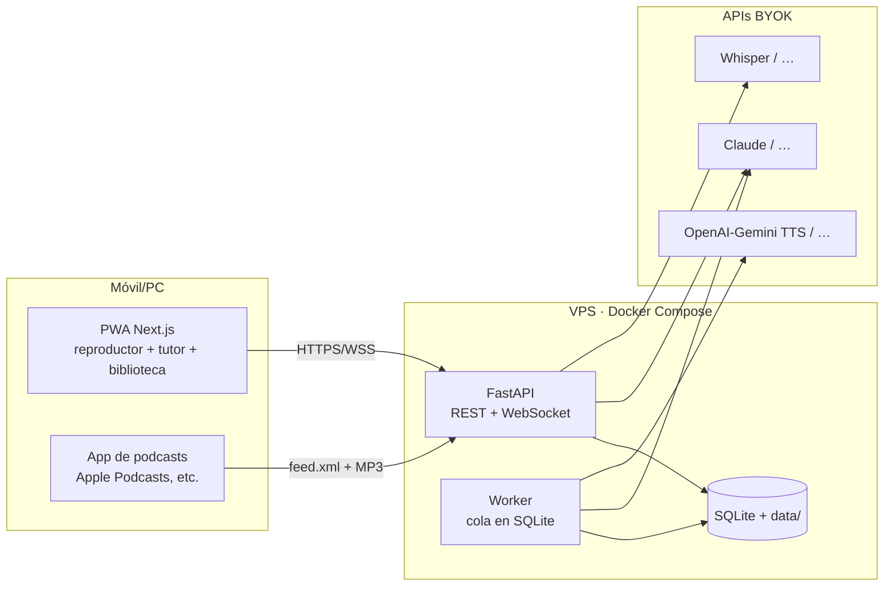

# listenyourPDFs — Arquitectura técnica

> Versión 1.0 (2026-08-04). Decisiones cerradas con el autor pregunta a pregunta.
> Requisitos: `01-problema-y-solucion.md` · Fases: `02-PRD.md`.

## 1. Decisiones de arquitectura

| # | Decisión | Elección | Notas |
|---|---|---|---|
| A1 | Estructura | **Monorepo**: `backend/` (Python FastAPI) + `frontend/` (Next.js PWA) + `deploy/` (Docker Compose) | Un solo repo, un solo clone |
| A2 | Trabajos largos | **Proceso worker separado + cola persistida en SQLite** | Sobrevive a reinicios y reanuda; sin Redis. Migrable si algún día hay multiusuario |
| A3 | Formato de audio | **Un MP3 por bloque (~párrafo, 30-90s) + playlist ordenada** | Play rápido, saltos por sección, cache granular, sync texto↔audio por bloque. Para RSS se concatenan los bloques en un MP3 único por documento |
| A4 | Tiempo real | **WebSockets** (progreso de generación + streaming de respuestas del tutor) | Elección del autor, prepara el manos-libres de v2. Reconexión automática en el cliente; los WS deben configurarse en el proxy (Coolify lo soporta) |
| A5 | Seguridad de instancia | **Token único** definido en `.env`; login de un campo, cookie persistente | El feed RSS lleva su propio token en la URL. Multiusuario queda fuera (RF-7.7 C) |
| A6 | Estrategia de generación | **Bajo demanda puro**: al subir se genera solo el arranque; durante la escucha el worker va ~10 min por delante de la posición | Excepción: "enviar a podcast" (RSS) genera el documento completo y concatena — es la única vía de pre-generación total |
| A7 | STT por defecto | **Whisper API (OpenAI)** | Robusto con ruido de calle; coste despreciable; intercambiable (RF-7.4) |
| A8 | LLM por defecto | **Claude** (D7) | Limpieza con modelo mediano (Haiku), Q&A/tutor con modelo grande |
| A9 | TTS por defecto | **OpenAI o Gemini TTS** — se fija en el spike S0.3 con prueba ciega | Kokoro (local) y ElevenLabs como alternativas de la interfaz |
| A10 | Persistencia | **SQLite (WAL) + sistema de archivos** (`data/pdfs/`, `data/audio/`, `data/db.sqlite`) | Backup = copiar `data/`. sqlite-vec solo si el Q&A lo necesita |
| A11 | Despliegue | **Docker Compose** (backend+worker+frontend) en **VPS con Coolify** | HTTPS automático. El dominio del autor: **pendiente de decisión** (subdominio propio / compra / sslip.io) |
| A12 | Extracción PDF | Candidatas: **docling, pymupdf4llm, marker** — se fija en el spike S0.2 con 5 PDFs reales | Detrás de una interfaz `Extractor` para poder cambiarla |

## 2. Componentes



- **API (FastAPI):** endpoints REST, WebSocket de eventos, servido de audio estático, feed RSS, Q&A del tutor (síncrono: STT→LLM→TTS de la respuesta).
- **Worker (mismo código, proceso aparte):** consume `jobs` de SQLite — extracción, limpieza por sección, síntesis de bloques (bajo demanda con colchón), concatenación para RSS.
- **Frontend (Next.js PWA):** biblioteca, reproductor (playlist de bloques encadenados + Media Session), índice navegable, botón push-to-talk (MediaRecorder), marcas, QR de onboarding.

## 3. Modelo de datos (SQLite)

```
documents   id, title, filename, language, status(uploaded|extracting|ready|error),
            created_at, total_cost_cents, rss_published_at, full_mp3_path
sections    id, document_id, idx, title, page_start, page_end
blocks      id, section_id, idx, text_clean, audio_path, audio_status(pending|generating|done|error),
            duration_ms, tts_cost_cents, text_hash   ← cache: nunca re-sintetizar mismo hash
jobs        id, type(extract|synthesize|concat_rss), payload_json, status(pending|running|done|error),
            attempts, created_at, updated_at
positions   document_id, block_id, offset_ms, updated_at        ← una fila por doc (mono-usuario)
marks       id, document_id, block_id, kind(gold|confused), note, created_at
qa_log      id, document_id, block_id, question, answer, section_ref, cost_cents, created_at
settings    key, value    ← proveedor activo, voz, velocidad por defecto, etc.
```

## 4. API

**REST** (todo bajo token; `Authorization: Bearer` o cookie):
```
POST   /api/documents                  subir PDF → job de extracción
GET    /api/documents                  biblioteca con estado y progreso
GET    /api/documents/{id}             estructura (secciones/bloques) + playlist
DELETE /api/documents/{id}             borrado real (archivos incluidos)
GET    /api/documents/{id}/blocks/{bid}/audio    MP3 del bloque (genera si falta → 202 + evento WS)
POST   /api/documents/{id}/position    persistir posición (cada pocos segundos)
POST   /api/documents/{id}/marks       crear marca
POST   /api/documents/{id}/ask        Q&A: multipart audio (push-to-talk) o JSON texto
POST   /api/documents/{id}/publish-rss  genera todo + concatena + publica episodio
GET    /feed.xml?token=...             feed RSS del podcast privado
GET    /audio/{doc}.mp3?token=...      MP3 completo (episodios RSS)
GET    /api/qr                         PNG del QR de onboarding
GET    /api/costs                      gasto por documento y mes (RNF-2)
```

**WebSocket** `/ws?token=...` — eventos servidor→cliente:
```
job.progress      {document_id, phase, pct}          extracción/síntesis
block.ready       {document_id, block_id}            el reproductor encadena sin esperar
answer.delta      {request_id, text_delta}           respuesta del tutor en streaming
answer.audio      {request_id, audio_url}            audio de la respuesta listo
```
Cliente→servidor solo control ligero (subscribe a un documento); las acciones van por REST.

## 5. Interfaces de proveedor (RF-7.4)

```python
class LLMProvider(Protocol):
    def clean_section(text, doc_context) -> CleanResult          # limpieza para audio
    def answer(question, doc_excerpts, lang) -> Iterator[str]    # Q&A anclado, streaming
class TTSProvider(Protocol):
    def synthesize(text, voice, lang) -> AudioResult             # bytes MP3 + duración
class STTProvider(Protocol):
    def transcribe(audio_bytes, lang_hint) -> str
class Extractor(Protocol):
    def extract(pdf_path) -> DocStructure                        # secciones + bloques + metadatos
```
Selección por variables de entorno (`LLM_PROVIDER=claude`, `TTS_PROVIDER=openai`, …).
Implementaciones MVP: Claude · OpenAI-TTS y/o Gemini-TTS (según S0.3) · Whisper API · extractor según S0.2.
Post-MVP: Ollama, Kokoro, ElevenLabs, whisper.cpp.

## 6. Flujos clave

**Subida:** `POST /documents` → job `extract` → estructura+bloques en BD → job `synthesize` de los primeros ~10 min → `block.ready` → play disponible en <60s (RNF-1).

**Escucha (bajo demanda, A6):** cada `position` recibida dispara síntesis de bloques hasta posición+10 min. Salto a sección sin audio → síntesis prioritaria del bloque destino (espera ~5-15s con indicador).

**Push-to-talk:** botón → pausa + graba (MediaRecorder) → `POST /ask` con audio → Whisper → Claude con los bloques relevantes como contexto (por sección actual + búsqueda simple; embeddings solo si hace falta) → respuesta streaming por WS → TTS de la respuesta → suena → reproducción retoma en el bloque exacto. Regla dura RNF-3: responder solo desde el documento, citar sección, "no está en el documento" explícito.

**RSS (D16):** `publish-rss` → genera bloques restantes → concatena a `{doc}.mp3` (ffmpeg) → episodio en `feed.xml`. El coste de completar el documento se muestra antes de confirmar.

## 7. Estructura del repo

```
backend/    app/ (api/, worker/, providers/, pipeline/, models/), tests/, pyproject.toml
frontend/   app/, components/, lib/, tests/  (Next.js 15, Tailwind v4, TS, PWA)
deploy/     docker-compose.yml, .env.example, README-selfhost.md
docs/       01..03, spikes/
```

## 8. Pendiente (no bloquea el arranque)

- **Dominio del autor** (A11): decidir antes del despliegue en VPS (Fase 4); el desarrollo local y los spikes no lo necesitan.
- Voz/motor TTS definitivo (S0.3) y extractor PDF (S0.2): los deciden los spikes de la Fase 0.
